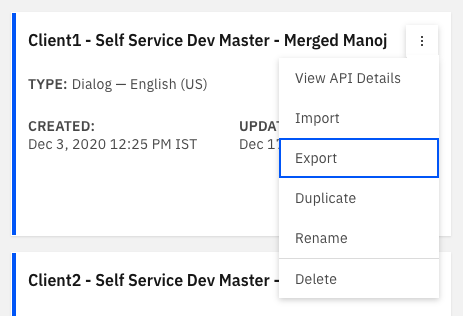
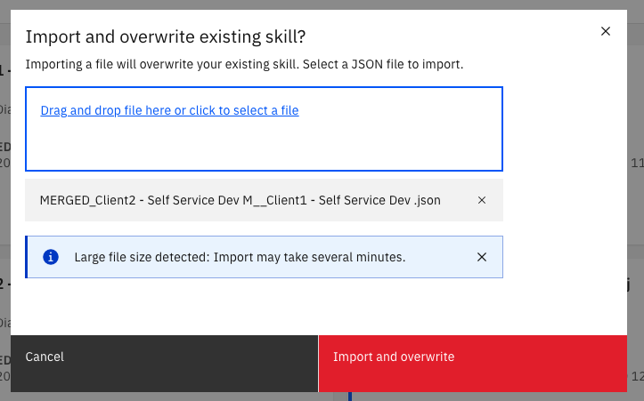

# Copying nodes from one skill to another skill in Watson Assistant

This is a guide for developers to copy nodes from once skill to another skill in Watson Assistant.

## Pre Requisites
1. [NodeJs](https://nodejs.org/en/)

## Table of contents:

1. [Export the skills from Watson Assistant](#1-export-the-skills-from-watson-assistant)
2. [Prepare and Run the script to copy nodes from one skill to another skill](#2-prepare-and-run-the-script-to-copy-nodes-from-one-skill-to-another-skill)
3. [Import the skill back in Watson Assistant](#3-import-the-skill-back-in-watson-assistant)

### 1. Export the skills from Watson Assistant

- To copy nodes from one skill to another skill, we will have to export the skills. 

- In this tutorial we have a node named: `YES_Claims -NEW NODE` present in the skill named: `Client1 - Self Service Dev Master - Merged Manoj`.


- Export the skill by clicking on the 3 dot menu and selecting **Export**.



- We have another skill named: `Client2 - Self Service Dev Master - copy Manoj` in which we will be copying the `YES_Claims -NEW NODE` node from `Client1 - Self Service Dev Master - Merged Manoj` skill.


- Export the second skill by clicking on the 3 dot menu and selecting **Export**.


- Once both the skills are downloaded we can proceed to the next step.


### 2. Prepare and Run the script to copy nodes from one skill to another skill

- Clone the repo locally. In a terminal, run:
```bash
$ git clone https://github.com/manojjahgirdar/copying-nodes-watson-assistant.git
```

- Go to the cloned directory, In terminal run:
```bash
$ cd copying-nodes-watson-assistant
```

- Install the required libraries for the node app to run, In terminal run:
```bash
$ npm install
``` 

- Copy the downloaded skills in the `copying-nodes-watson-assistant/skills` directory and rename the initial skill as `skill1.json` and the second skill as `skill2.json`.

>Example: In our case we will rename `skill-Client1---Self-Service-Dev-Master---Merged-Manoj.json` to `skill1.json` and `skill-Client2---Self-Service-Dev-Master---copy-Manoj.json` to `skill2.json`

- Finally run the NodeJs script, from the cloned directory run the command in terminal:
```bash
$ node app.js
```

>NOTE: If the IDs of the node from skill1 and skill2 conflict then the script automatically changes the IDs. You can check the log on the terminal.

- You can see the output json file in the `copying-nodes-watson-assistant` directory, the filename will be displayed in the terminal logs as shown. 


- We have successfully copied the `YES_Claims -NEW NODE` node from `Client1 - Self Service Dev Master - Merged Manoj` to `Client2 - Self Service Dev Master - copy Manoj`, now we can import the skill back in Watson Assistant in the next step. 

### 3. Import the skill back in Watson Assistant

- In Watson Assistant, you can either create a new skill with the merged json file or update an existing skill with the merged json file. We will be demonstrating the later in this tutorial.

- Select the skill which you would like to update and click on 3 dot menu and select **Import**.


- Upload the merged skill and click on **Import and overwrite**.



- You can now see the node successfully copied in the new skill.


## References

- [watson-assistant-skills-merger](https://github.com/tomiwaog/watson-assistant-skills-merger)

